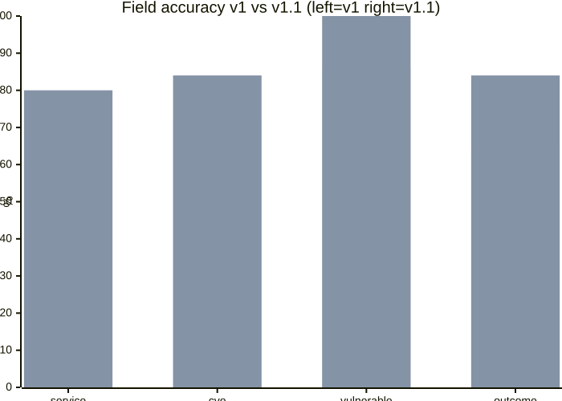
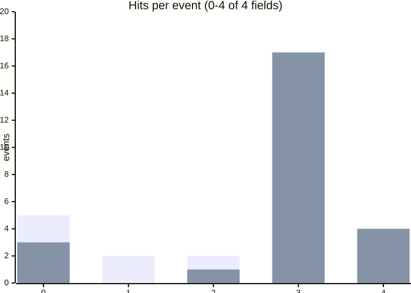
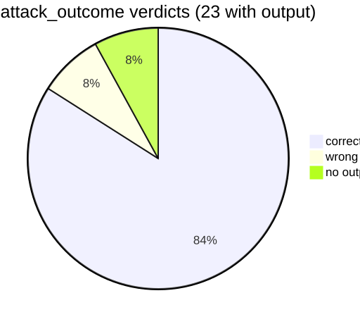
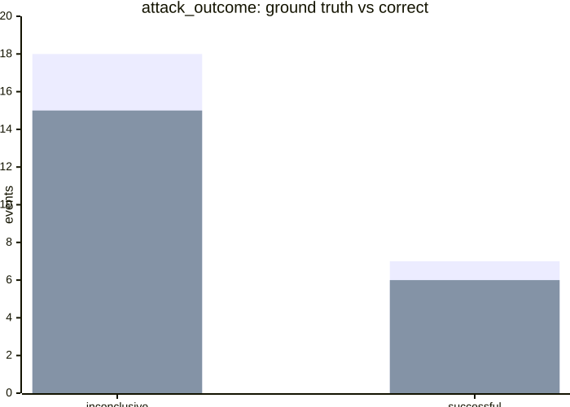
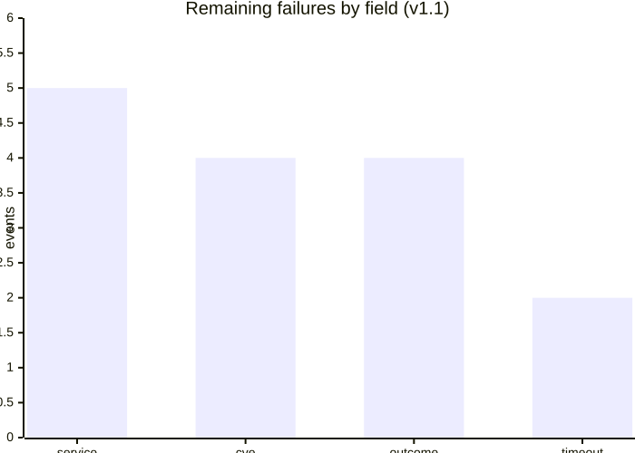

# Benchmark: Net4n6Bench Evaluation (v1 vs v1.1)

> 评测口径：IDS-25 公平口径（ground truth 缺失字段不评分）。数据文件见 `benchmark/results/`（本地生成，未入库）。
> 复测方式：技能规则 + 提示词约束（不换模型、不加工具）后全量重跑 IDS 25 事件。

## 1. Field Accuracy Comparison

| Metric | v1 | v1.1 | Delta |
|---|---|---|---|
| service | 60% | **80%** | +20pp |
| cve | 72% | **84%** | +12pp |
| vulnerable | 86% | **100%** | +14pp |
| attack_outcome | 64% | **84%** | +20pp |
| Perfect verdicts (4/4) | 1/25 | **4/25** | +3 |
| Verdict parse rate | 21/25 | **23/25** | +2 |

## 2. Hits per Event Distribution

Events with ≥3/4 fields correct: 16/25 (64%) → **21/25 (84%)**. Zero-hit events: 5 → 3 (all timeout / hardest samples).

## 3. attack_outcome Verdict Quality

- Ground truth contains only two classes: inconclusive (18) / successful (7)
- "Evidence-insufficient → inconclusive" rule works: 15/18 correct (v1 was overconfident)
- Residual: 1 overconfident misjudgment + 1 missed successful + 2 no-output

## 4. Remaining Failures (v1.1 bottleneck shifted)

| Category | Count | Nature |
|---|---|---|
| service naming / granularity | 5 | semantically right, strict string match loses (e.g. `atlassian bitbucket server` vs `bitbucket`) |
| cve exact match | 4 | sibling-CVE / version deduction residuals |
| attack_outcome boundary | 4 | evidence-strength edge cases |
| timeout (no output) | 2 | deep reasoning > 600s |

## 5. Cost

- v1.1 runtime: ~6.5 min/event (v1 ~2 min); 25 events ≈ 163 min total
- Full 200-event benchmark would take ~20h + tokens

## 6. v1.2 Plan (short)

1. **P0-1** service alias normalization in scoring + "shortest official product name" rule in skill
2. **P0-2** auto-retry on timeout events (currently only parse-failure retries)
3. **P1-1** mail-protocol (MAPI / Outlook vs Exchange) features in skill
4. **P1-2** full 40-event regression (Public subset was not re-run in v1.1)
5. **P2** CVE version-window deduction rules; auto report generation; token-meter cost tracking

---
*Generated 2026-08-21. Full analysis (Chinese) archived in the project's Obsidian vault.*
